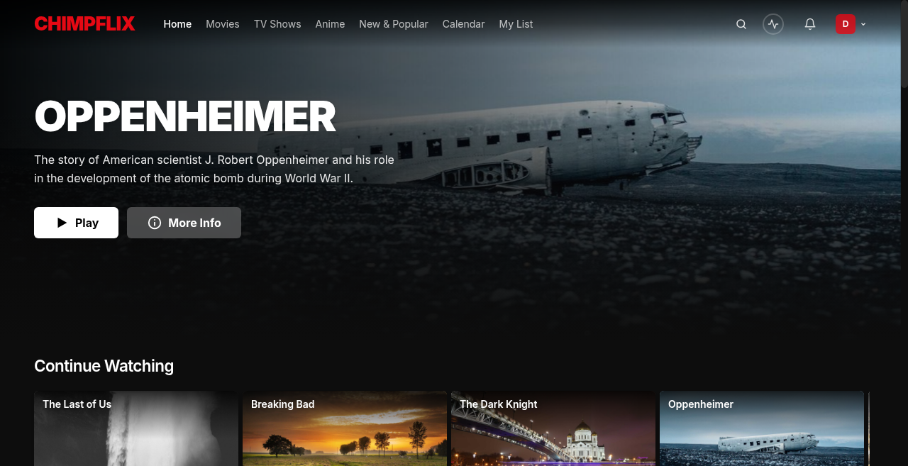
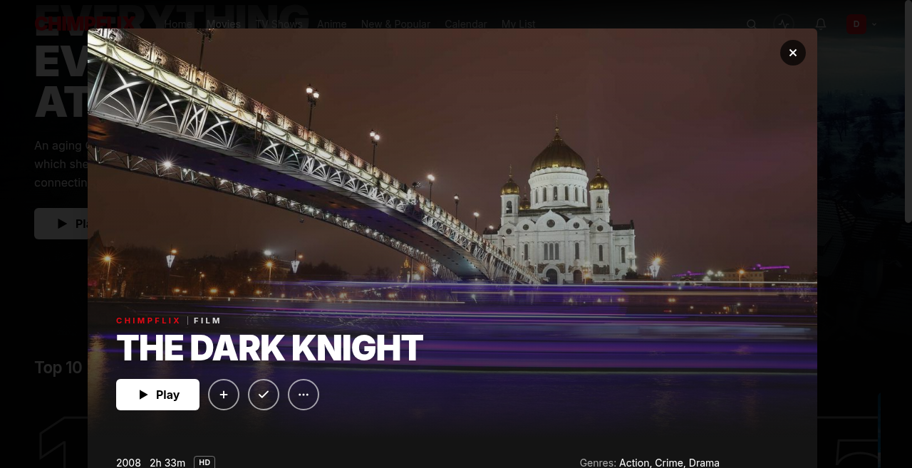
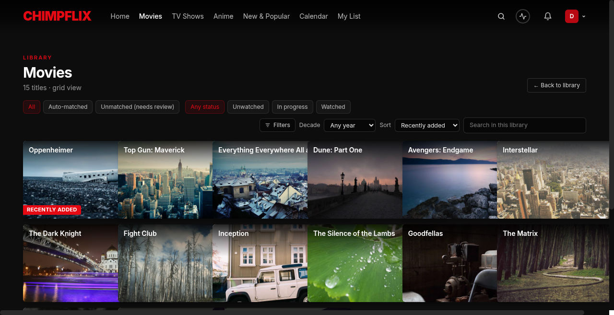
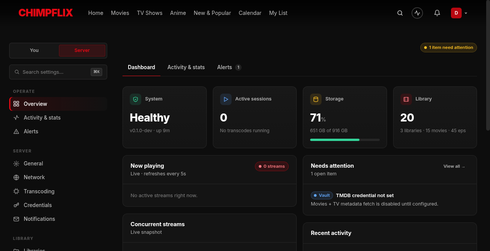
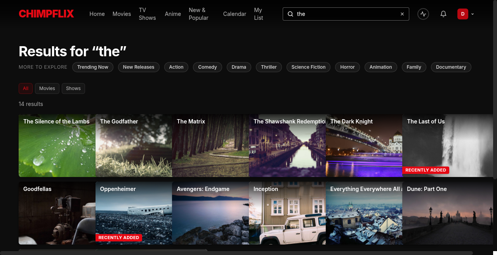
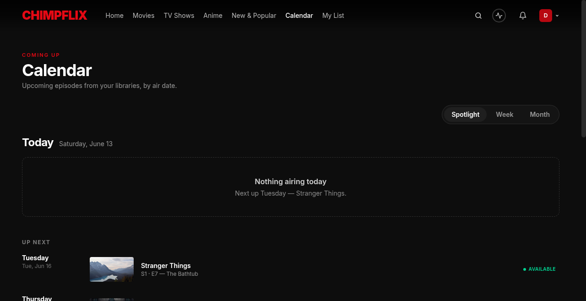

# ChimpFlix

[](LICENSE)
[](https://www.rust-lang.org/)
[](https://nextjs.org/)
[](https://www.sqlite.org/)
[](https://www.docker.com/)

**A self-hosted, open-source media server with a Netflix-style web UI.**

Stream your personal movie and TV library from any device. Zero analytics,
zero phone-home, zero third-party JavaScript. Everything stays on your box.

> **Status: v0.1 feature-complete.** Library scan, direct-play, HLS
> transcoding (including HEVC + GPU acceleration), multi-user auth, smart
> collections, Trakt sync, Google Cast, and a full Netflix-style admin
> surface are all shipped. See [docs/ARCHITECTURE.md](docs/ARCHITECTURE.md)
> for the full picture.

---

## Screenshots

| Home — discovery rails | Movie detail |
|---|---|
|  |  |

| Library browser | Admin dashboard |
|---|---|
|  |  |

| Search | Calendar |
|---|---|
|  |  |

> **Try it yourself:** `bash scripts/demo/setup.sh` — see [docs/DEMO.md](docs/DEMO.md) for details.

---

## What ChimpFlix is (and is not)

ChimpFlix is a brand-new media server: net-new code, no API compatibility
or shared lineage with Plex, Jellyfin, Emby, or any other media server.
The goal is a fast, efficient, Rust-based backend with a polished Netflix-
style web UI, packaged for Docker, and easy to self-host.

**v0.1 scope (shipped):**

- Library scan (manual, filesystem-watch, and Plex-style scheduled
  periodic) + multi-agent metadata (TMDB, TVDB, TVMaze, AniList) for
  movies, TV shows, and anime.
- Direct-play streaming + per-user watch state.
- Discovery rails: a home Top 10 (TMDB weekly trending) plus per-library,
  type-aware Top 10 rails — TMDB top-rated for movie/TV libraries,
  MyAnimeList ranking for anime libraries — each blended with the
  library's local top-watched.
- HLS transcoding via ffmpeg, including HEVC, ABR ladders, hardware
  decode/encode (NVENC / VAAPI / QSV / VideoToolbox / AMF), HDR→SDR
  tonemap, two-pass loudness normalization, and burned/sidecar
  subtitle paths.
- Cast to Chromecast / Google TV via a custom, HLS-aware CAF receiver
  (token-authenticated manifest/segment sub-requests), plus AirPlay on
  Safari/iOS. See [docs/cast-receiver.md](docs/cast-receiver.md) for setup.
- Multi-user authentication (with 2FA), per-library access control, and
  a three-tier role hierarchy (Owner > Admin > User).
- Admin surface: scheduled-task scheduler with maintenance windows,
  webhooks, audit log, backup + restore, library health dashboard,
  smart collections, pre-roll stings, and bulk operations.

**Not in v0.1:** music libraries, photos, Live TV / DVR, plugin system,
mobile apps, sync-to-device, remote relay streaming.

## Repo layout

```text
chimpflix/
├── Cargo.toml              # Rust workspace
├── crates/
│   ├── server/             # axum HTTP + WebSocket server (the binary)
│   ├── library/            # FS scanner, SQLite schema, library DB
│   ├── metadata/           # TMDB and future metadata agents
│   ├── transcoder/         # ffmpeg/ffprobe orchestration
│   └── common/             # shared types and helpers
├── web/                    # Next.js frontend (the Netflix-style UI)
├── docker/                 # Dockerfile(s)
├── docs/                   # ARCHITECTURE, SCHEMA, API
└── docker-compose.yml      # two-service compose: server + web
```

## Quick start (local dev)

You'll need Rust (stable, picked up automatically via `rust-toolchain.toml`),
Node 22, and `ffmpeg` + `ffprobe` on `PATH`. For hardware-accelerated
transcoding the matching driver also needs to be installed on the host
(NVIDIA CUDA, Intel VAAPI/QSV, etc.); software fallback works without
any GPU.

```bash
# Backend
cargo run -p chimpflix-server
# → listening on 0.0.0.0:8080
# → curl http://127.0.0.1:8080/health
#   { "status": "ok", "version": "0.1.0-dev", "uptime_s": 3 }

# Frontend (separate terminal)
cd web
npm install
npm run dev
# → open http://localhost:3000
```

The backend creates `./data/chimpflix.db` on first run and applies all
migrations. Delete the `data/` directory to start fresh.

## Docker

```bash
mkdir -p ./data
docker compose up -d --build
open http://localhost:3000
```

[docker-compose.yml](docker-compose.yml) builds two images from the same
multi-stage [docker/Dockerfile](docker/Dockerfile): `chimpflix-server` (the
Rust binary + ffmpeg, on :8080) and `chimpflix-web` (the Next.js standalone
build, on :3000). They share a compose network; only `:3000` is exposed
to the host by default.

## Configuration

The backend reads a small set of environment variables:

| Variable | Default | Purpose |
| --- | --- | --- |
| `BIND_ADDR` | `0.0.0.0:8080` | Listening address. |
| `DATA_DIR` | `./data` | Where `chimpflix.db` and caches live. |
| `RUST_LOG` | `info,sqlx=warn` | `tracing-subscriber` filter. |
| `CHIMPFLIX_CIRCUIT_BREAKER_THRESHOLD` | `3` | Optional. Consecutive rate-limit failures from an external provider (TMDB, OMDb, MyAnimeList, …) before its circuit opens and calls fast-fail. |
| `CHIMPFLIX_CIRCUIT_BREAKER_OPEN_SECS` | `60` | Optional. How long a provider's circuit stays open before a probe is allowed. |

Most operator settings (periodic scan interval, Continue Watching tuning,
file-watcher backend, etc.) live in the admin UI under **Settings**, not
in env vars. External provider keys — TMDB, TVDB, OMDb, Trakt,
OpenSubtitles, and the **MyAnimeList** Client ID — are stored in the
encrypted credential vault under **Settings → Server → Credentials**.

Configuration for the web frontend lives in
[web/.env.example](web/.env.example). The frontend points at the
ChimpFlix backend directly — no Plex bridge.

## Development

```bash
cargo build --workspace           # all crates
cargo run -p chimpflix-server     # the binary
cargo test --workspace
cargo fmt --all
cargo clippy --workspace --all-targets -- -D warnings
```

CI runs `fmt`, `clippy`, `cargo test`, the Next.js build, and both Docker
image builds on every PR. See [.github/workflows/ci.yml](.github/workflows/ci.yml).

## Privacy

The server makes outbound HTTP calls **only** to services the operator
explicitly configures (TMDB, TVDB, AniList, OMDb, Trakt, OpenSubtitles,
MyAnimeList, and SMTP). The one exception is the anime Top 10: when an
anime library exists, the server fetches a public anime-id mapping file
from GitHub (`raw.githubusercontent.com`) so it can match MyAnimeList
rankings to titles in your library — no account, no credentials, no data
sent. No analytics. No phone-home. No auto-update check. No third-party
JavaScript in the web bundle (no Google Fonts, no CDN scripts, no
tracking). Everything stays on the box the operator runs.

See [SECURITY.md](SECURITY.md) for the full no-telemetry commitment
and how to report a vulnerability.

## Supported browsers

ChimpFlix targets the current and one previous major version of:

- **Chromium-based** (Chrome, Edge, Brave, Arc) 120+
- **Firefox** 120+
- **Safari** 17+ on macOS and iOS (HLS playback is best-effort on
  Safari ≤16)

The web frontend uses Media Source Extensions (MSE) where supported
and falls back to native HLS on Safari. Older browsers will load the
UI but may hit playback edge cases that the maintainers won't
prioritise.

## Operator self-rescue

If you lose access to the owner account, the server binary has
subcommands that recover without poking at SQLite directly. Stop the
live server first, then:

```bash
# Reset the owner's password (prompts for new value without echo).
chimpflix-server owner-password-reset --email owner@example.com

# Clear a lost 2FA enrollment so the next login skips TOTP.
chimpflix-server owner-2fa-reset --email owner@example.com

# Re-encrypt every vault row with a new master key (keys read from env vars).
OLD=$(cat .old-key) NEW=$(openssl rand -hex 32) \
  chimpflix-server vault-rotate --old-key-env OLD --new-key-env NEW
```

Run `chimpflix-server --help` for the full subcommand reference, and
see [docs/DEPLOYMENT.md](docs/DEPLOYMENT.md) for the pre-flight
checklist before exposing the server publicly.

## Documentation

- [docs/ARCHITECTURE.md](docs/ARCHITECTURE.md) — system shape, crate
  boundaries, process model, request lifecycles.
- [docs/SCHEMA.md](docs/SCHEMA.md) — SQLite schema for v0.1.
- [docs/DEMO.md](docs/DEMO.md) — run an isolated demo instance with sample
  data in one command (no personal library required).
- [docs/API.md](docs/API.md) — REST endpoints and WebSocket event catalog.
- [docs/cast-receiver.md](docs/cast-receiver.md) — Google Cast custom
  receiver setup: App ID registration, test-device registration, and
  on-device verification.
- [docs/DEPLOYMENT.md](docs/DEPLOYMENT.md) — reverse-proxy recipes,
  trusted-proxy config, TLS, public-exposure preflight.
- [docs/PUBLIC_RELEASE_HARDENING.md](docs/PUBLIC_RELEASE_HARDENING.md)
  — running hardening plan and confirmed-fine invariants.
- [CONTRIBUTING.md](CONTRIBUTING.md) — how to build, style, PR process.
- [SECURITY.md](SECURITY.md) — vulnerability disclosure and the
  no-telemetry commitment.
- [CHANGELOG.md](CHANGELOG.md) — what shipped, release by release.

## License

[Apache 2.0](LICENSE). See [NOTICE](NOTICE) for attribution requirements.
